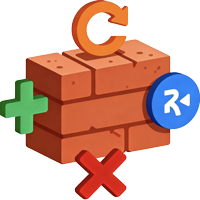
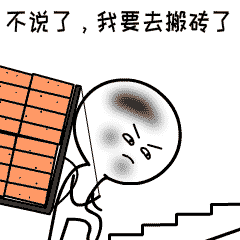

  

## 🚀 项目介绍

Element Plus Pro 是一个基于 Vue3 + Element Plus 的开箱即用的二次封装组件库

## 🌐 演示地址

[查看文档](https://element-plus-pro.vercel.app/)

[完整示例](https://bricklayer-admin.vercel.app)

## ✨ 特性

- 🎯 **开箱即用** - 提供完整的项目结构和配置
- 🧩 **组件封装** - 深度封装常用业务组件，减少重复代码
- 📱 **响应式设计** - 支持多种设备屏幕适配
- 🔧 **Hook 封装** - 提供常用业务逻辑 Hook
- 📦 **示例完善** - 每个组件都有对应的使用示例

## 🛠️ 技术栈

- **框架：** Vue3 + TypeScript
- **UI 组件库：** Element Plus + Element Plus Icons
- **样式：** UnoCSS (原子化 CSS)
- **路由：** Vue Router 4
- **HTTP 请求：** Axios
- **工具库：** VueUse + Lodash-es
- **构建工具：** Vite

## 📦 已封装组件

## 📚 示例页面

项目提供了丰富的示例页面，帮助您快速了解各组件的使用方法：

  

少写点烂代码，多摸点真·鱼。加油！！！

   
  

